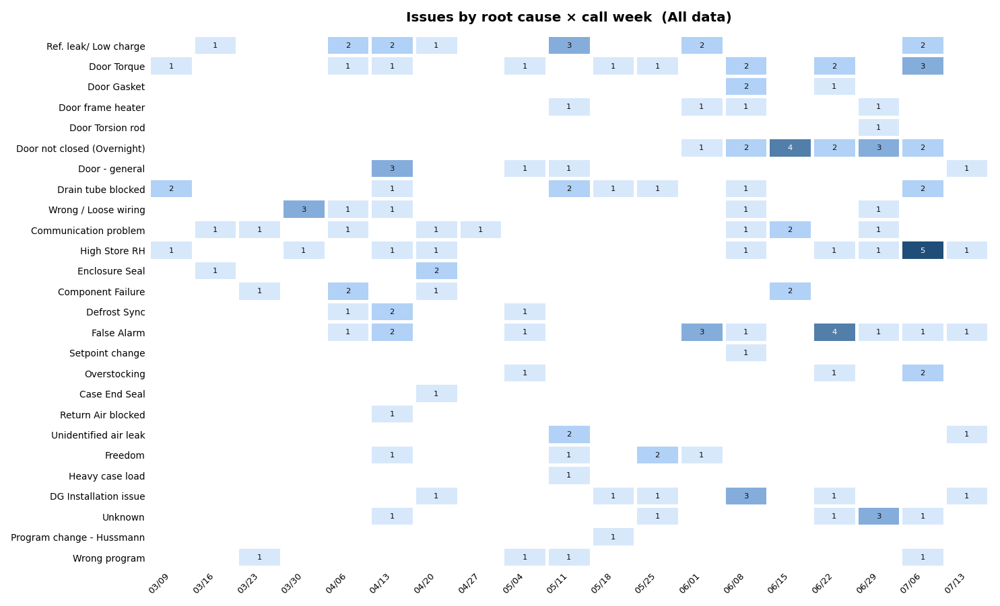

# Impl 2 — Cause × week heatmap on the Graphs (dashboard) sheet

**Start file: `DG-template-fix1.xlsx`** — the output of `WORKBOOK-FIX-1-ERRORS.md`,
which must be complete and accepted first. Save the result as `DG-template-impl2.xlsx`
(project root). The original lineage rules apply: this builds on the ORIGINAL workbook
structure (Summary rows `$4:$240`, `Root Cause Settings`, `By Commission Week`,
charts on `Graphs`), NOT the abandoned `outputs/` reorganization.

Scope: exactly one deliverable — a cause × call-week heatmap visible on the **Graphs**
sheet (the workbook's dashboard) alongside the six existing charts, matching their
look. Nothing else. All working rules from Fix 1 Part A apply (local-copy workflow,
render-and-inspect every step, COM constraints, `[1]`-reference check, restore
`Graphs!B3/B4` to Jun 1 / Jul 15 before the final save).

## THE TARGET — this image is the contract

`WORKBOOK-IMPL-2-heatmap-target.png` (same folder as this file) was rendered from the
workbook's actual Summary data. **The implementation is done when an export of the
Excel range is, cell for cell, the same picture**: same 26 causes in the same
(Settings) order down the side, same 19–20 mm/dd week columns, same counts producing
the same relative blue intensity, white where zero, **every nonzero cell showing its
count** (dark digits on light cells; white digits via a CF font rule on cells ≥ 4),
bold title. Fonts and exact pixel dimensions may differ (Excel
vs. matplotlib); the data pattern, color logic, and layout may not.

Open the target image before writing any code, and keep comparing your range export
against it after every formatting step. Specific patterns your export MUST reproduce
(they are in the data — if they're missing, your formulas or CF are wrong):
- "Door not closed (Overnight)": empty until the week of 06/01, then a continuous
  dark streak with a **4** at 06/15 and **3** at 06/29.
- "High Store RH": the single darkest cell of the grid, a **5**, at 07/06.
- "False Alarm": a **3** at 06/01 and **4** at 06/22.
- The bottom third of the grid (Setpoint change, Case End Seal, Heavy case load…)
  is almost entirely white — sparse single cells only.
- No column or row is uniformly dark; if everything renders one color, the CF scale
  range is wrong (this exact failure shipped once already).

The steps below tell you HOW to build it in Excel; the image above tells you WHAT
correct looks like. When they seem to conflict, the image wins.

## Why a linked picture (read before building)

A conditional-formatting heatmap is a cell range, not a chart object, so it cannot
float on the Graphs sheet directly. The Excel-native mechanism is a **linked picture**
(Camera object): a floating, live-rendering image of a source range. When source cells
change — new data, date-window change, renamed cause — the picture updates by itself.
No macros, no refresh button, prints and copies like the neighboring charts.
All visual polish must therefore happen on the SOURCE range; the picture just mirrors it.

## Step 1 — Build the source block on a new sheet

1. New sheet `Heatmap Calc`, tab color gray, positioned after `Data Checks`. Layout:
   - `A1`: sheet banner: "Cause × week heatmap — source range for the linked picture
     on Graphs. Format HERE, not on the picture."
   - `A3`: title cell:
     `="Issues by root cause × call week  ("&Graphs!$B$5&")"` — bold, size 12, same
     font family as the chart titles (the picture will carry it as the chart title).
   - `B4:U4` week headers: `=TEXT('By Commission Week'!A106,"mm/dd")` → `A125`
     (the same 20 call weeks chart 4 plots), size 9.
   - `A5:A30` causes: `=IF('Root Cause Settings'!A4="","",'Root Cause Settings'!A4)`
     down for 26 rows (extend to row 30 only if causes exist; keep the block tight),
     size 9.5, right-aligned.
   - `B5:U30` data:
     `=IF($A5="","",COUNTIFS(Summary!$E$4:$E$240,$A5,Summary!$A$4:$A$240,">="&'By Commission Week'!$A$106+(COLUMN()-2)*7,Summary!$A$4:$A$240,"<"&'By Commission Week'!$A$106+(COLUMN()-2)*7+7))`
     — or the equivalent referencing each week-start cell directly via the header row
     (implementer's choice; direct cell refs are more readable than COLUMN() math).
2. **Timeline filter — include it.** Add the standard window factors so the heatmap
   obeys `Graphs!B3/B4` like charts 1/3/5/6:
   `…, Summary!$A$4:$A$240,">="&IF(Graphs!$B$3="",0,Graphs!$B$3), Summary!$A$4:$A$240,"<"&IF(Graphs!$B$4="",2958465,Graphs!$B$4+1)`
   (COUNTIFS accepts the extra criteria pairs on the same range). Out-of-window weeks
   go blank/zero and the dynamic title stays truthful.
3. Formatting on the block (this IS the deliverable's look):
   - 3-color scale on `B5:U30` ONLY — never include header rows in the CF range (a
     previous build died on exactly this): min white `FFFFFF`, midpoint percentile 50
     `9EC5F4`, max `1F4E79`.
   - Number format `0;;;` on the data cells (zeros invisible).
   - Near-square cells: data column widths ~5.5, row heights ~15.
   - White hairline borders between data cells (reads as a tiled grid).
4. **Export the block as PNG (CopyPicture → temp ChartObject → Export → delete temp)
   and inspect**: graded blues, blank zeros, readable mm/dd headers, the two known
   patterns visible. Do not continue until this picture is right.

## Step 2 — Place the linked picture on Graphs

1. Select/copy the source range (title through last data row, e.g.
   `'Heatmap Calc'!A3:U30`), then paste onto `Graphs` as a linked picture:
   `$range.Copy()`; `$graphs.Pictures.Paste($true)` (Link:=true).
   Verify the pasted object's `.Formula` reads `='Heatmap Calc'!$A$3:$U$30` — that
   formula IS the live link. No formula = static screenshot = reject and redo.
2. Position: in the free area below/beside the existing six charts (inspect the
   sheet's current chart extents first; do not overlap anything). Match the footprint
   of a wide chart (~560–620 pt wide), scale proportionally.
3. Name it `Heatmap - Cause x Week`.
4. **Live-link tests (all three, mandatory):**
   a. Set `Graphs!B4` = Jun 30 → weeks after Jun 30 visibly empty in the picture and
      the embedded title shows "Jun 1 to Jun 30". Restore.
   b. Temporarily change one Summary row's cause → the corresponding cell shifts
      intensity without any manual action. Revert.
   c. Close, reopen, repeat (a) — still live.

## Step 3 — Integrate

1. `Data Checks`: add a row — sum of the heatmap data range must equal the same
   window-filtered classified-line count computed straight off Summary
   (`SUMPRODUCT` with identical window factors); "Review" on mismatch.
2. If the workbook has a README/notes cell convention (`Graphs!A1` holds usage notes),
   add one line: the heatmap is a linked picture; format it on `Heatmap Calc`.

## Acceptance (on the reopened `DG-template-impl2.xlsx` from the real path)

- [ ] **Side-by-side match against `WORKBOOK-IMPL-2-heatmap-target.png`** with both
      dates blank ("All data"): every pattern listed in THE TARGET section is present
      in your export — the 4/3 door streak, the 5 hot cell, the 3/4 False Alarm
      cells, the sparse white bottom third. This is the core acceptance test; export
      the Excel range and visually compare before checking anything else.
- [ ] Graphs sheet shows the heatmap next to the charts: graded blue tiles, blank
      zeros, mm/dd headers, dynamic title matching the neighboring charts' period.
- [ ] All three live-link tests pass.
- [ ] **PowerPoint workflow test**: select the heatmap picture on Graphs, Copy, paste
      into a blank PowerPoint slide (regular paste or Paste as Picture — the same
      workflow used for the six charts). The slide must show the full heatmap,
      legible at slide size, matching the target image. This is the deliverable's
      actual end use; if the paste comes out clipped, blurry, or partial, fix the
      source-range sizing until it doesn't.
- [ ] No overlap with the six charts; they remain pixel-identical (spot-check exports
      of charts 1 and 5 against Fix 1's baseline).
- [ ] New Data Check row is OK at Jun 1–Jul 15 AND after temporarily narrowing the
      window (restore afterwards).
- [ ] `DG-template-fix1.xlsx` untouched; output saved as `DG-template-impl2.xlsx`
      and verified intact after close/reopen from the OneDrive path.
