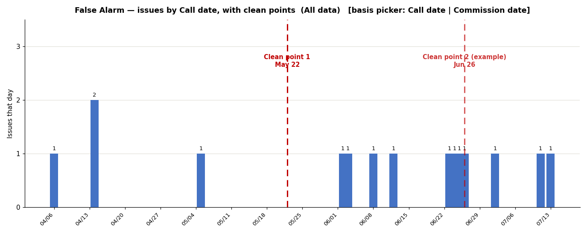

# Impl 3 — Per-cause daily timeline with clean-point lines (v2 — supersedes any earlier version)

**Start file: `DG-template-impl2.xlsx`** (accepted, includes the heatmap number
formatting). Save as `DG-template-impl3.xlsx` (project root). Original-lineage
structure (Summary rows `$4:$240`: A=call date, D=commission date, E=root cause;
`Root Cause Settings` causes `A4:A80`, clean-point date col E; charts on `Graphs`).
All working rules from `WORKBOOK-FIX-1-ERRORS.md` Part A apply verbatim (local-copy
workflow, render-and-inspect every step, COM constraints, `[1]`-reference check,
restore `Graphs!B3/B4` to Jun 1 / Jul 15 before final save).

**Design change from any earlier draft:** the x-axis is **actual dates (daily), not
weekly buckets**, and clean points are **thin vertical lines**, never red bars.

## THE TARGET — this image is the contract

`WORKBOOK-IMPL-3-cleanpoint-target.png` (same folder) is rendered from the workbook's
actual data for **False Alarm** on the **Call date** basis. The deliverable is ONE
chart on the Graphs sheet with **two pickers** that reproduces this picture for any
selection:

1. **Root-cause picker** — dropdown of all causes.
2. **Date-basis picker** — dropdown with exactly two options: `Call date` /
   `Commission date`. It controls which Summary date column the bars count on.

The picture's contract details:
- **Daily blue columns** (`4472C4`) at the actual dates issues occurred — thin bars
  on a continuous date axis, empty space where nothing happened. NOT weekly buckets.
- **A thin dashed red vertical line per clean-point date of the picked cause**, full
  plot height, labeled with its date. Up to 3 per cause. Lines only exist where a
  date exists: 1 date → 1 line, 0 dates → 0 lines. The second line in the image is
  marked "(example)" — it appears only during the acceptance test when a second date
  is temporarily added.
- Count labels above bars; y-axis "Issues that day" (integers); bold dynamic title
  `<cause> — issues by <basis>, with clean points (<period>)`.

Known data for False Alarm / Call date (verify against your export): single calls on
04/06, 05/05, then a cluster 06/02–06/26 (with 2 on 04/14, four consecutive singles
06/23–06/26), ending 07/02, 07/11, 07/13. Clean-point line at 05/22 in the empty gap.
The image wins over the steps if they conflict.

## Step 1 — Three clean-point dates per cause (data model)

In `Root Cause Settings`, append two columns in the first free columns (H and I if
free — verify; nothing may be overwritten):
- `H3` header: `Clean Point 2`; `I3` header: `Clean Point 3`. Date-formatted, blank
  by default, data-validated as dates.
- Column E remains `Clean-Point Date` and is **Clean Point 1** — do not touch its
  values; the after/before charts and Summary G flag keep using it unchanged.
- Add a note cell above/beside: "Up to 3 clean points per cause; all drawn as lines
  on the timeline chart."

## Step 2 — Calc block (new hidden sheet `Timeline Calc`, banner on A1)

1. **Pickers**: `cause` cell (DV list = `='Root Cause Settings'!$A$4:$A$80`, default
   `False Alarm`) and `basis` cell (DV list `Call date,Commission date`, default
   `Call date`). Label both. Names: `tl_cause`, `tl_basis`.
2. **Daily date spine**: one row per day covering the data span with margin —
   2026-03-01 through 2026-08-31 (~184 rows). First cell the literal date, rest
   `=<prev>+1`.
3. **Daily counts**:
   `=IF(tl_basis="Call date", COUNTIFS(Summary!$A$4:$A$240,$<day>, <window factors on A>), COUNTIFS(Summary!$D$4:$D$240,$<day>, <window factors on D>))`
   filtered additionally by `Summary!$E$4:$E$240 = tl_cause`, and by the standard
   `Graphs!B3/B4` window factors (same pattern as the heatmap block). Show 0 as 0
   (the chart needs a continuous series; bars of height 0 are invisible anyway).
4. **Clean-point columns** (k = 1..3): `cpdate_k` =
   `IFERROR(INDEX('Root Cause Settings'!$E/H/I column, MATCH(tl_cause, causes, 0)),"")`
   — E for k=1, H for k=2, I for k=3. `marker_k` daily column:
   `=IF($<day>=cpdate_k, <ceiling>, NA())` where ceiling = `MAX(daily counts)+1`
   (so lines top out above the tallest bar).
5. **Title cell**: `=tl_cause&" — issues by "&tl_basis&", with clean points  ("&Graphs!$B$5&")"`.
6. After writing formulas via COM, read back and assert no `[1]` external refs.

## Step 3 — The chart

1. Column chart on `Graphs`, clear of all existing objects (check extents first).
   Series 1 = daily counts vs the date spine, fill `4472C4`.
   **Category axis must be a date axis** (`Axes(1).CategoryType = 3` / xlTimeScale),
   number format `mm/dd`, major unit 7 days, labels rotated 45 — this is what makes
   sparse daily bars sit at their true dates with gaps between them.
   Data labels ON with format `0;;;` (zeros invisible — the standard lesson).
   Gap width small (~30) so single-day bars stay visible at ~180 categories.
2. **The lines**: for each k add `marker_k` as a column series, overlap 100:
   preferred rendering = fill none + **minus-100% error bar**, red `C00000`, dashed,
   width 2 → a true thin vertical line at that date. Sanctioned fallback: the series
   as a plain narrow column, fill `C00000` — at daily granularity one bar IS visually
   a thin line (unlike the weekly version, which is why red bars were rejected).
   Add a data label at the top point of each marker series showing the clean-point
   date (link it to the `cpdate_k` cell text, e.g. a helper cell
   `="Clean point "&k&CHAR(10)&TEXT(cpdate_k,"mmm d")`).
3. Legend: hide it, or keep only "Calls" — the lines carry their own labels.
4. Title linked to the Step-2 title cell, bold, 12pt. Y-axis integer-only
   (major unit 1), axis title "Issues that day".
5. Export and inspect against the target after every sub-step.

## Step 4 — Carry-over fix + integration

1. **Missed Fix-1 item (B3): Summary root-cause dropdown** — list DV on
   `Summary!E4:E240`, source = the Settings cause list, blanks allowed, Stop style.
   Data Check "Root causes not in Settings" must stay 0.
2. Data Check row: `SUM(daily counts)` must equal the same COUNTIFS computed directly
   off Summary for `tl_cause`+`tl_basis`+window → Review on mismatch.
3. Pickers must be reachable without unhiding `Timeline Calc`: place linked/mirrored
   picker cells near the chart on `Graphs` (two DV cells the calc sheet reads), so
   the user changes cause/basis right next to the graph.

## Acceptance (on reopened `DG-template-impl3.xlsx` from the real path)

- [ ] **Target match**: cause=False Alarm, basis=Call date, dates blank → export
      matches the target image minus the "(example)" line: same daily bars at the
      same dates, one dashed line at May 22 with label, empty-gap placement visible.
- [ ] **Multiple lines**: put 2026-06-26 in False Alarm's `Clean Point 2` → second
      line appears exactly as in the target; clear the cell → it disappears. Both
      states exported and inspected.
- [ ] **Zero lines**: pick a cause with no clean-point date (e.g. `Unknown`) → bars
      only, no red anywhere, no ghost markers.
- [ ] **Basis test**: switch to `Commission date` → bars relocate to commission dates
      (visibly different distribution), title says "issues by Commission date".
      Switch back.
- [ ] **Picker test**: `Door Torque` → its calls, its Jun 5 line. **Timeline test**:
      To=Jun 30 → later bars vanish, title updates; restore Jun 1 / Jul 15.
- [ ] **PowerPoint test**: copy chart → paste into a slide → legible, lines and
      labels intact.
- [ ] Summary E dropdown works (carry-over); existing six charts + heatmap picture
      untouched; no overlaps; Data Checks all OK; file intact after close/reopen
      from the OneDrive path.
