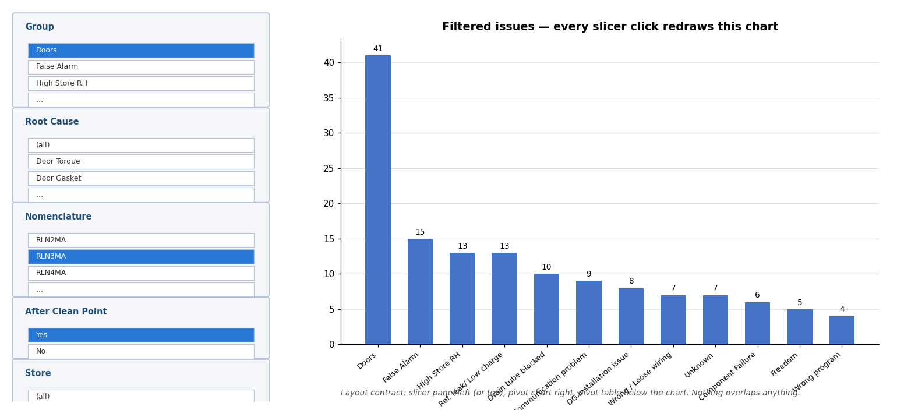

# Impl 4 — "Explore" sheet: PivotChart + slicers

**Start file: `DG-New master/DG-New master.xlsx`** (current accepted state: 9 charts +
heatmap + clean-point timeline on Dashboard). Work on a local copy in `%TEMP%`, push
back once at the end (OneDrive reverts mid-session saves in this folder — proven
repeatedly). Before the final save: calculation = automatic (assert
`xlCalculationAutomatic` at save time), Dashboard dates restored to Jun 1 / Jul 15.
After push-back: reopen from the real path and re-verify one item.

Scope: ONE new visible sheet `Explore` (tab right after Dashboard) containing a
PivotTable, a PivotChart, and 5 slicers. Nothing else changes. The Dashboard stays
the presentation layer; Explore is the slice-and-dice layer.

## THE TARGET — this image is the contract

`WORKBOOK-IMPL-4-explore-target.png` (same folder) shows the required experience and
layout: a panel of 5 slicers (Group, Root Cause, Nomenclature, After Clean Point,
Store), and a sorted, labeled column chart that **redraws on every slicer click**.
Chart style matches the workbook: fill `4472C4`, bold 12pt title, value labels, no
legend, no pivot field buttons on the chart. Layout contract: slicers left (or top),
chart beside/below them, pivot table below the chart — **no object overlaps any
other object or any used cell**. Verify placement numerically against actual shape
bounds and cell rects (rows on these sheets are ~13.8pt — never assume heights) —
this exact mistake has been made twice; measure, don't estimate.

## Step 0 — Verified current state (do not rediscover)

- `Summary`: headers **row 1**, data rows 2–240. Columns: A Call Date, B Work Order,
  C Store, D Commission Date, E Root Cause, F Notes, G After Clean Point,
  H Case Serial (from Raw), I "Column1" (junk), J Store connect/FEXA,
  **K Group (formula helper, already exists)**.
- Nomenclature prefixes live at `'Case Nomenclature Graph'!A2:A7`
  (RLN2MA…RMN5MA).
- COM on this machine: `SlicerCaches.Add` (NOT Add2 — timelines unavailable),
  `[double]` casts for Add() geometry args, `.Formula`/`.FormulaArray` (no
  `Formula2`), `foreach` over COM collections yields the property (use indexed
  access), exports need Excel visible, wrap independent steps in try/catch AND read
  the transcript — a caught exception is an unfinished step, not a success.
- After writing any formula via COM, read it back and assert it contains no `[1]`.

## Step 1 — Summary helper: Nomenclature column

Add column **L** (first free): header `Nomenclature` (bold, matching row-1 style),
rows 2–240:
`=IF($H2="","",IFERROR(INDEX('Case Nomenclature Graph'!$A$2:$A$7,MATCH(TRUE,ISNUMBER(SEARCH('Case Nomenclature Graph'!$A$2:$A$7,$H2)),0)),"other"))`
entered as CSE (`.FormulaArray` on L2, then Copy/PasteSpecial(-4123) to L3:L240).
Spot-check 3 rows against their serials before continuing.

## Step 2 — Pivot + chart + slicers on `Explore`

1. New sheet `Explore`; A1 banner: "Slice-and-dice. Slicers filter the chart and
   table live. Right-click → Refresh after adding Summary rows."
2. PivotCache on `Summary!A1:L240`; PivotTable placed low enough to leave the top
   area free for slicers + chart (e.g. anchor ~A30): rows = Group, values =
   Count of Work Order, sorted **descending by count** (`PivotFields("Group").
   AutoSort(2, <datafield name>)` — datafield via `$pt.DataFields(1).Name`).
3. PivotChart bound to the pivot (create the ChartObject, `SetSourceData
   $pt.TableRange1` — confirm `$ch.PivotLayout` is non-null): clustered column,
   series fill `4472C4`, data labels `0;;;`, no legend, bold 12pt title
   "Filtered issues - use the slicers", `ShowAllFieldButtons = $false`.
4. Slicers via `$wb.SlicerCaches.Add($pt, <field>)` for: `Group`, `Root Cause`,
   `Nomenclature`, `After Clean Point`, `Store`. Style `SlicerStyleLight1`; arrange
   per the target layout with measured coordinates; the Store slicer is long — give
   it the tallest box. Junk items check: if a slicer shows blank/`0` entries, fix
   the source formula (helpers must return `""`, never 0) and refresh the cache.
5. Nothing overlaps: assert every slicer/chart rect against every other and against
   the pivot's `TableRange1` cells, numerically, before saving.

## Step 3 — Integrate

- README/Dashboard note: one line pointing to Explore ("slicing happens there;
  refresh the pivot after new data").
- Data Check row: pivot grand total (all slicers cleared) must equal
  `SUMPRODUCT(--(Summary!$E$2:$E$240<>""))` → Review on mismatch. (Pivot caches go
  stale — this check catches an unrefreshed pivot.)

## Acceptance (on the reopened file from the real path)

- [ ] Explore matches the target layout; full-sheet region export INSPECTED: five
      slicers, chart, pivot — zero overlaps, no junk slicer items.
- [ ] **Click test 1**: clear all → chart shows groups sorted desc, Doors = 41 first
      bar, grand total = classified-lines count.
- [ ] **Click test 2**: Nomenclature = RLN3MA + After Clean Point = Yes → grand
      total equals the workbook's own
      `SUMPRODUCT(--(Summary L="RLN3MA"),--(Summary G="Yes"))` computed live
      (record both numbers in the run log; they must match).
- [ ] **Click test 3**: Group = Doors → chart redraws to door causes only when Root
      Cause is added to rows... (skip if rows stay Group — instead: bar shrinks to
      Doors only). Then clear-all restores the full chart. Export before/after
      images for each click test — the exports must visibly differ.
- [ ] PowerPoint test: copy the pivot chart → paste into a slide → legible.
- [ ] Dashboard untouched (spot-check chart 1 + timeline exports); calculation
      automatic at save; Data Checks OK; file intact after close/reopen from the
      real path.
