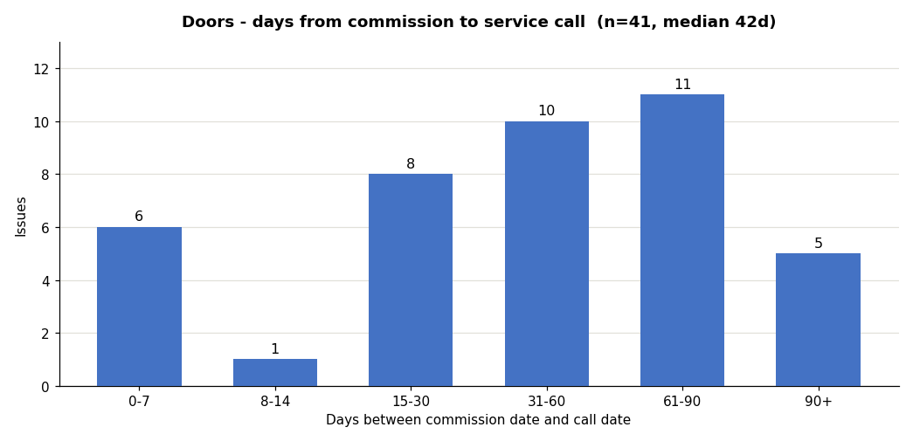

# Impl 5 — Commission-to-call gap histogram (picker-aware)

**Start file: `DG-New master/DG-New master.xlsx`** (after Impl 4 if it has run;
otherwise current state — this build is independent of Impl 4). Local-copy workflow,
push back once, reopen-verify — the standing rules from the previous impl files
(`WORKBOOK-IMPL-4-EXPLORE-SLICERS.md` Step 0 lists the COM constraints; they all
apply, including: measure real cell/shape geometry — rows are ~13.8pt — and assert
zero overlap numerically before saving; calculation = automatic asserted at save).

Scope: ONE new chart on the Dashboard answering "how long after a store is
commissioned do issues of the picked cause/group appear?" It **shares the existing
`tl_cause` picker** with the clean-point timeline — changing that one dropdown
updates both charts. No new pickers. (`tl_basis` does not apply here — the gap is
call date minus commission date by definition.)

## THE TARGET — this image is the contract

Rendered from the workbook's actual data with tl_cause = **Doors**. The contract:
six fixed buckets (0-7, 8-14, 15-30, 31-60, 61-90, 90+ days), workbook-blue
(`4472C4`) columns with value labels, axis titles as shown, and a dynamic title
`<pick> - days from commission to service call (n=<count>, median <d>d)`.

Known numbers for Doors, all-data window (your export must match exactly):
**6 / 1 / 8 / 10 / 11 / 5, n=41, median 42d.** If any bucket differs, the formulas
are wrong — the image wins over the steps.

## Step 1 — Summary helper: Gap days

First free Summary column (M if Impl 4 added Nomenclature at L; otherwise L —
detect, don't assume): header `Gap (days)`, rows 2–240:
`=IF(OR($A2="",$D2="",NOT(ISNUMBER($A2)),NOT(ISNUMBER($D2))),"",$A2-$D2)`
Spot-check one known WO. Rows lacking either date stay blank and drop out of all
counts (correct: no invented gaps).

## Step 2 — Calc block on `Timeline Calc`

Place right of the existing blocks (first free columns, e.g. X:AB — verify; P–V are
occupied). Banner cell on top: "Gap histogram source — shares tl_cause".

| col | content |
|---|---|
| bucket label | the six fixed labels above |
| lo | 0, 8, 15, 31, 61, 91 |
| hi | 7, 14, 30, 60, 90, 100000 |
| count | group-aware, window-aware COUNTIFS (below) |

Count formula pattern (G = the gap column letter from Step 1, K = Group, E = Root
Cause; window factors on call date A exactly as the daily-counts formula uses):
`=IF(ISNUMBER(MATCH(tl_cause,Settings!$B$4:$B$83,0)), COUNTIFS(Summary!$K$2:$K$240,tl_cause, Summary!$<G>$2:$<G>$240,">="&<lo>, Summary!$<G>$2:$<G>$240,"<="&<hi>, <window factors on Summary!$A>), COUNTIFS(Summary!$E$2:$E$240,tl_cause, ...same...))`

Below the table:
- `n` = SUM of the six counts.
- `median` = CSE over the gap column with the same scope:
  `=IFERROR(MEDIAN(IF(((Summary!$K$2:$K$240=tl_cause)*ISNUMBER(MATCH(tl_cause,Settings!$B$4:$B$83,0))+(Summary!$E$2:$E$240=tl_cause)*ISERROR(MATCH(tl_cause,Settings!$B$4:$B$83,0)))*(Summary!$<G>$2:$<G>$240<>""),Summary!$<G>$2:$<G>$240)),"")`
  (via `.FormulaArray`; if it exceeds the 255-char CSE limit, split scope into a
  helper column of per-row in-scope gaps and MEDIAN over that — implementer's call,
  result is what's tested).
- Title cell: `=tl_cause&" - days from commission to service call (n="&<n>&", median "&<median>&"d)"`.
- Read back every formula; assert no `[1]`.

Window note: counts respect the Dashboard From/To window on the **call date**, same
as every other picker chart. The target image is the all-data state.

## Step 3 — The chart

Column chart on Dashboard in measured free space (below the clean-point chart /
next to it — enumerate all shapes first; after Impl 4 the layout may have changed).
Categories = bucket labels, values = counts, fill `4472C4`, gap ~40, data labels
`0;;;`, no legend, title linked to the title cell (bold, 12pt), y-axis integer major
unit. Name it `Chart 11 - Gap Histogram`. Export and inspect against the target.

## Step 4 — Data Check

`n` (the block's SUM) must equal a direct SUMPRODUCT of in-scope, in-window,
gap-bearing Summary rows → Review on mismatch.

## Acceptance (reopened file from the real path)

- [ ] tl_cause = Doors, dates blank → export matches the target: 6/1/8/10/11/5,
      n=41, median 42d in the title.
- [ ] Picker test: tl_cause = DG Installation issue → buckets change and skew early
      (installation signature); the clean-point chart updates simultaneously (shared
      picker proof — export both charts in one screenshot region).
- [ ] Window test: To = Jun 30 → counts shrink, title's n drops; restore Jun 1/Jul 15.
- [ ] Rows missing either date are excluded (n for Doors stays 41 even though Doors
      has 41 dated issues — no blank-driven inflation).
- [ ] No overlap with any object (numeric assertion in the run log); PowerPoint
      paste test; calculation automatic at save; Dashboard dates restored; existing
      charts untouched; file intact after close/reopen from the real path.
